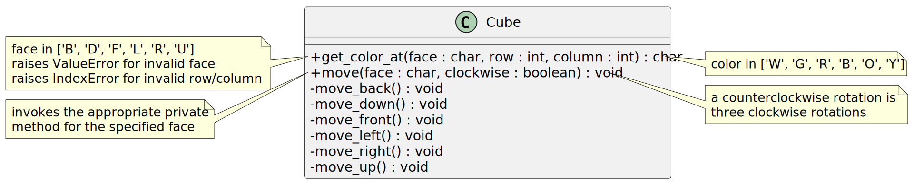
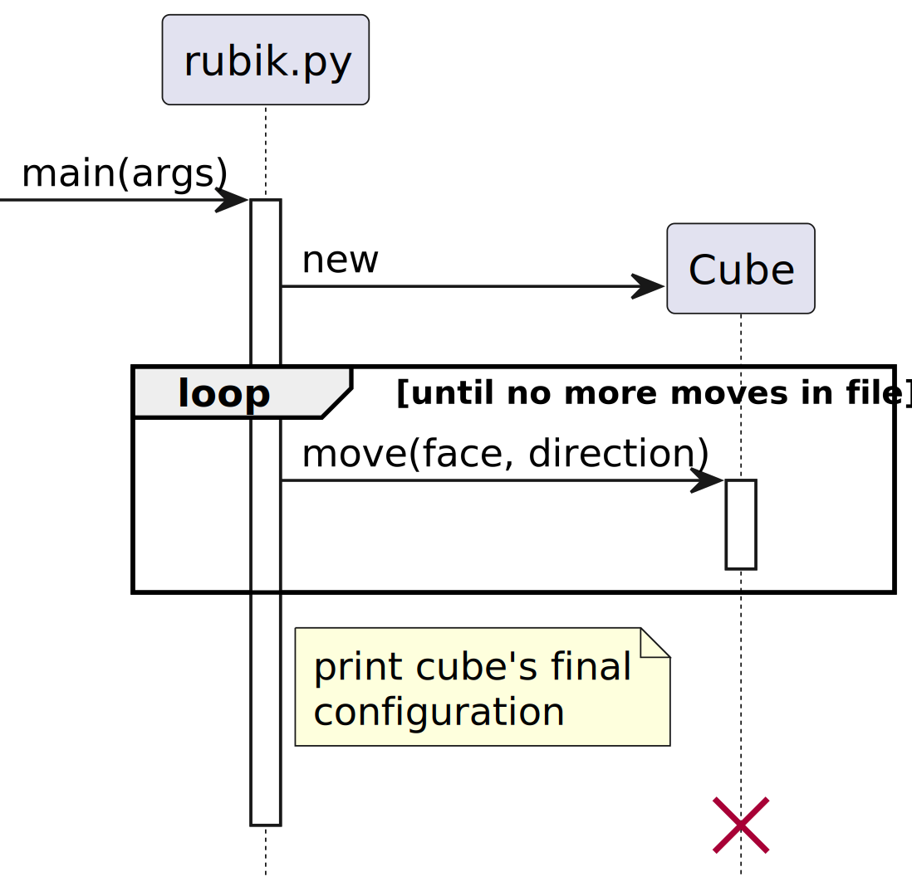

# Rubik's Cube

A Rubik's Cube is a 3-dimensional puzzle invented in 1974 by Ernő Rubik. The
cube comprises 26 miniature cubes (also known as "cubies" or "cubelets") where
the visible face(s) of each miniature cube is a different color and each face
of the cube may be rotated independently of the others. When solved, each face
of the cube must have only a single color.

## Problem Description

A Rubik's cube is a 3-dimensional puzzle. Each face is subdivided into 9
colored squares as shown in the following illustration:

When solved, each face of the cube has a single color (e.g., the top is
completely white, the front is completely red, the right is completely blue,
etc.).

### Requirements

David Singmaster developed a notation for moves when solving a Rubik's Cube. In
this notation,

- the face is indicated using a single character (`F`, `B`, `U`, `D`, `L`, and
  `R` for front, back, up, down, left, and right respectively) and
- a prime symbol indicates a counterclockwise rotation (instead of a clockwise
  rotation).

For example, `F'` indicates a counterclockwise rotation of the front face of
the cube, and `U` indicates a clockwise rotation of the up (top) face of the
cube.

The starting configuration of the cube may be represented using 54 characters:

- Each character indicates a different color: `W` for white, `G` for green, `R`
  for red, `B` for blue, `O` for orange, and `Y` for yellow.
- Each face is enumerated in row-major order. For example, `WGGRRBOYO`
  represents the following face:
  ~~~ text
  WGG
  RRB
  OYO
  ~~~
- The faces appear in the following order: up, left, front, right, back, down.
- Spaces may be included for readability (e.g., each face may be separated by a
  space character); these spaces are ignored.

For example,

~~~ text
GWBYWRYOR YRBOOOOYO RGWWGGWBR GGOWRWYRW WROBBBBYB GYGOYBYGR
~~~

depicts the following cube:

~~~ text
        G W B
        Y W R
        Y O R

Y R B   R G W   G G O   W R O
O O O   W G G   W R W   B B B
O Y O   W B R   Y R W   B Y B

        G Y G
        O Y B
        Y G R
~~~

where the cube has been "flattened" with the front face at the intersection of
the cross.

The starting configuration of a Rubik's Cube and a sequence of moves may be
stored in a file. Blank lines may be included for readability; any blank lines
should be ignored. After reading the file, the final configuration of the cube
is printed to the screen. For example, a file with the contents shown below

~~~ text
WWWWWWWWW GGGGGGGGG RRRRRRRRR BBBBBBBBB OOOOOOOOO YYYYYYYYY

U
F'
R
~~~

results in the following configuration of the Rubik's Cube:

~~~ text
        W W R
        W W R
        O B R

R R W   B R G   Y Y Y   B G G
G G W   B R Y   B B O   W O O
G G W   B R Y   B B O   W O O

        R G O
        Y Y O
        Y Y G
~~~

#### Functional

- The program **MUST** read the specification of a Rubik's Cube and a sequence
  of moves from a specified file.
- Running the program **MUST** print the final configuration of the Rubik's
  Cube.
- The program **SHOULD** report an error if an invalid starting configuration
  of the Rubik's Cube is specified (e.g., a cube with 10 white squares or a
  cube with 2 faces that both have red in the center).
- The program **MAY** shuffle a Rubik's Cube by making a series of random
  moves.

#### Non-functional

- The program **MUST** be written in Python.[^1]
- The program **MUST** adhere to [PEP 8, the style guide for Python
  code](https://peps.python.org/pep-0008/).
- The program **MUST** use 1-based indexing to reference cubelets. For example,
  `('F', 1, 1)` refers to the top-left cell of the front face and `('L', 3, 3)`
  to the bottom-right cell of the left face.[^2]
- The program **MUST NOT** execute any code (except from initializing global
  variables) when loaded. That is, the program **MUST** have a well-defined
  entry point that is executed only when the program is invoked by a user.

[^1]: This non-functional requirement is technically a *constraint*: it
      restricts the design of the system, in this case to facilitate automated
      testing of the prescribed design and implementation of the system.

[^2]: This non-functional requirement is essential for automated testing. In
      practice, it should be a recommendation rather than an absolute
      requirement (i.e., **MUST** would be replaced with **SHOULD**) and the
      test cases revised to match the implementation.

## Design

A Rubik's Cube may be represented in any number of ways.[^3] A
multi-dimensional (6x3x3) array is one way to model the cube where each face of
the cube is a 3x3 matrix of characters indicating the color at that position of
the cube.

[^3]: Howard A. Peelle, "Representing a Rubik's Cube in APL,"
      *SIGAPL APL Quote Quad*, Vol. 14, No. 4, pp. 255-262, ACM, June 1984.
      https://doi.org/10.1145/384283.801107

Most implementations are greatly simplified if a copy of the cube's
current state is made before a move and that copy used to map the original
position of each cubelet to its subsequent position.

A class diagram for the program appears below:

The following sequence diagram illustrates the entry point for the Python
module -- i.e., `main` is invoked when a user runs the module (but not when the
module is loaded):

### Alternatives

As previously mentioned, many alternatives exist for the implementation of a
Rubik's Cube. For example, a 54-element vector that corresponds to the
aforementioned starting configuration of a Rubik's Cube may be used instead of
a multi-dimensional array; this presentation  is simple and efficient but does
not lend itself to any insight into the structure of a Rubik's Cube. *As the
representation of the Rubik's Cube is a design decision instead of a
requirement, any representation may be used as long as the interface matches
those specified by the design.*

The increase in execution time and space utilization from creating a copy of
the cube can be avoided by moving the cubelets "in place." In practice, the
increased implementation complexity almost certainly negates these benefits, at
least for an initial implementation.

## Implementation

Python allows negative indices to access elements of a sequence (e.g., a list).
A negative index is interpreted relative to the end of the sequence. For
example,

~~~ python
x = [1, 2, 3]
last_element_of_list = x[-1]
~~~

stores "3" in the variable `last_element_of_list`. Take care to check the row
and column index when referencing cubelets. An `IndexError` must be raised when
an index is invalid:

~~~ python
raise IndexError
~~~

which is similar to "throwing" an exception in other programming languages.
Similarly, a `ValueError` must be raised when the face is invalid.

Python lacks strong encapsulation insofar as there are no restrictions on
accessing "private" member variables. By convention, prefixing an instance
variable with an underscore (`_`) indicates that the variable is **not** part
of the class's public API.[^4]

[^4]: Python, "[Private Variables](https://docs.python.org/3/tutorial/classes.html#private-variables)," 2022 (accessed 12 September 2022)

When an operation is invoked on a Python object, Python passes a reference to
the object as the first argument of the method. By convention, this parameter
is named `self`. The implementation of each method must include this parameter
-- e.g.,

~~~ python
  def __str__(self):
    ...
~~~

The `self` parameter allows accessing the object's instance variables and is
intentionally omitted from the prior class diagram to keep the class diagram
independent of the programming language.

Python uses a special method, `__init__`, to instantiate an object. This method
is comparable to constructors in other object-oriented programming languages.
For example, the following Python code creates a `Cube` object:

~~~ python
cube = Cube()
~~~

Like other methods, the first parameter of `__init__` should be `self`. To
allow the starting configuration of the cube to be specified, `__init__` should
have a second parameter with a default value. For example,

~~~ python
#   faces -> up        left      front     right     back      down
cube = Cube('GWBYWRYOR YRBOOOOYO RGWWGGWBR GGOWRWYRW WROBBBBYB GYGOYBYGR')
~~~~

creates a "jumbled" cube. Default parameters are specified in Python using the
assignment operator. For example,

~~~
def __init__(self, colors=' '.join([c * 9 for c in 'WGRBOY'])):
    ...
~~~

where the expression (i.e., `' '.join([c * 9 for c in 'WGRBOY'])`) creates the
string `WWWWWWWWW GGGGGGGGG RRRRRRRRR BBBBBBBBB OOOOOOOOO YYYYYYYYY`, which
represents a Rubik's Cube that is not jumbled.

The `__str__()` method of a class returns a string representation of the object
-- i.e., it is similar to Java's `toString()` method. This method (i.e.,
`__str__()`) is implicitly invoked when a string representation is desired,
such as when printing it.

### Work Items

Be sure to pass the corresponding unit test(s) after implementing each
operation.

1. Define all operations on the Cube class
2. Implement `__init__` (instantiation), `__str__` (an "informal" string
   representation), and `get_color_at` operations
3. Implement the move operation for each face[^5]
4. Read the specification of a Rubik's Cube from a file and execute the
   specified moves

[^5]: A physical Rubik's Cube is helpful when implementing each move, as it
      allows you to verify the correctness of the implementation visually. If
      you do not have a Rubik's Cube, an online application may be used instead
      (e.g., https://rubiks-cube-solver.com/).

## Testing

Unit tests provide statement coverage[^6] of all methods. Unit tests assume
that a Rubik's Cube is initialized by default so that white, green, red, blue,
orange, and yellow appear on the up, right, front, left, back, and down faces
respectively (i.e., a cube starts in a known -- and solved -- configuration).

[^6]: A test coverage report is provided although complete coverage is
      difficult to ensure without tailoring the test cases to the
      implementation. Aim for at least 80% coverage and review any lines that
      aren't covered to see why.

Integration tests cover reading the specification of a Rubik's Cube from a file
and manipulating it according to a specified sequence of moves.

## References

Python, "[PEP 8 - Style Guide for Python Code](https://bit.ly/3dsBiIh), 2001
(last updated 1 August 2013)

Python, "[A First Look at Classes](https://bit.ly/3RR9Lzl)," 2022 (accessed 17
September 2022)

Digital Ocean, "[Python Classes and Objects](https://do.co/3RUx4rS)," 3 August
2022

---

Footnotes
