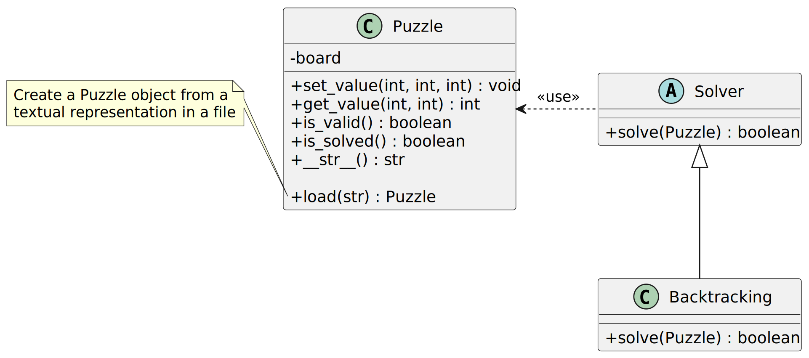
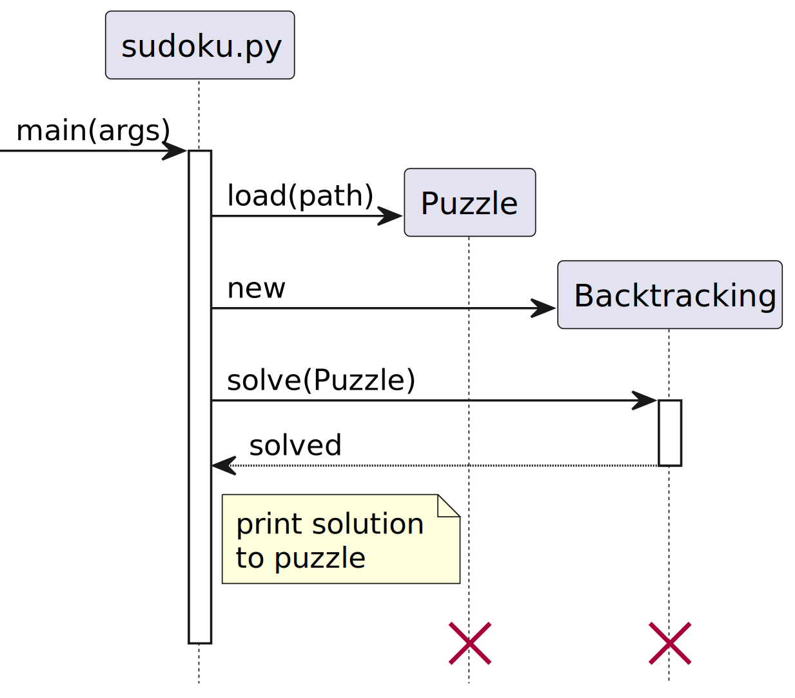

# Sudoku

Sudoku is a logic puzzle whose history traces to French puzzles from the 19th
century. The modern form of Sudoku became widely popular in the early 21st
century when newspapers started to publish daily puzzles.

Sudoku puzzles can be readily solved by a computer using programming techniques
taught in introductory computer science courses. Consequently, Sudoku offers a
chance to practice these techniques while developing an application that
someone can use when stuck trying to solve a Sudoku puzzle!

## Problem Description

The objective of Sudoku is to fill a 9x9 grid with the digits 1-9 in such a way
that all the following are true:

- each row contains all the digits 1-9,
- each column contains all the digits 1-9, and
- each 3x3 block contains all the digits 1-9.

For example, consider the following puzzle:

The following is a solution to this puzzle:

where the red digits are those that have been filled in to complete the puzzle.
Notice that this solution satisfies all the aforementioned constraints -- i.e.,
the digits 1-9 appear exactly once in each row, column, and 3x3 block.

### Requirements

A valid puzzle has the following text format:

- Each cell is delimited by a whitespace character (e.g., a space or newline)
  with the possible exception of the first cell on a row.
- A dot indicates that the cell is empty.
- Lines that are blank or contain only whitespace are ignored.

For example,

~~~ text
5 3 . . 7 . . . .
6 . . 1 9 5 . . .
. 9 8 . . . . 6 .
8 . . . 6 . . . 3
4 . . 8 . 3 . . 1
7 . . . 2 . . . 6
. 6 . . . . 2 8 .
. . . 4 1 9 . . 5
. . . . 8 . . 7 9
~~~

represents the prior puzzle (before it has been solved).

#### Functional

- The program **MUST** read a puzzle from a specified file.
- Running the program **MUST** print a solution to the specified puzzle or "No
  solution found" if a valid solution does not exist.
- The program **MUST** determine if a number placed in a certain cell violates
  a rule of Sudoku (e.g., the cell's row contains the same number twice).
- The program **MUST** determine if a puzzle has been solved correctly.

#### Non-functional

- The program **MUST** be written in Python.[^1]
- The program **MUST** adhere to [PEP 8, the style guide for Python
  code](https://peps.python.org/pep-0008/).
- The program **MUST** solve puzzles within 60 seconds.
- The program **SHOULD** use recursive backtacking to solve puzzles.
- The program **MUST** use 1-based indexing to reference cells. For example,
  `(1, 1)` refers to the top-left cell of the Sudoku puzzle and `(9, 9)` to the
  bottom-right cell of the Sudoku puzzle.
- The program **MUST NOT** execute any code (except from initializing global
  variables) when loaded. That is, the program **MUST** have a well-defined
  entry point that is executed only when the program is invoked by a user.

[^1]: This non-functional requirement is technically a *constraint*: it
      restricts the design of the system, in this case to facilitate automated
      testing of the prescribed design and implementation of the system.

### Use Cases

"Car trips are sooo boring," thought eight-year-old Brice. He flipped open the
book of puzzles his parents bought him for the trip, his eyes landing on a
Sudoku puzzle. "I guess Sudoku is better than nothing," muttered Brice,
half-hoping that his parents would hear, "but I hate it when I make mistakes."
Brice sat still for a little bit, not really motivated to start working on the
puzzle. "I wish I had a way to check my work as I went," he concluded. "That
would prevent what happened a few weeks ago when I filled in one of the first
cells incorrectly and worked for an hour only to erase all my work and start
over. If I had a way to check my work, though, then I'd receive instant
feedback if I happen to write the wrong number in a cell."

Maria is a Sudoku aficionado. When she wakes up at 6:15 a.m. each morning, she
grabs her phone to complete [the *New York Times*'s daily
puzzles](https://www.nytimes.com/puzzles/sudoku/). Maria is admittedly
mediocre, and sometimes her addiction causes her to be late to work. Once she
didn't arrive until 1:49 p.m. because she just *had* to finish the last puzzle
but couldn't figure out a handful of cells. In the evenings, Maria completes
the daily Sudoku puzzle in the local newspaper. These puzzles aren't as high
quality, and Maria dislikes waiting until the next day's paper to check her
solution (not to mention subscribing to a newspaper solely for the Sudoku
puzzle!). One time the local paper's puzzle had multiple solutions -- at least
Maria's solution didn't match the one that the paper published the next day.
Maria was so upset that she spent 37 minutes checking her solution and nearly
canceled her newspaper subscription! Consequently, Maria wants a way to check
her solution to each puzzle she attempts.

Regan's older sister loves to prove that she can do things better than Regan.
Tennis, soccer, [Catan](https://www.catan.com) -- you name it -- Regan's sister
loves winning, and she often does. Regan would like -- just for once -- to be
the best at something. Regan likes Sudoku -- math puzzles are way better than
crossword puzzles -- and recently the mentor for Regan's junior high
programming club mentioned that computers can be used to find solutions to
puzzles. Regan's older sister wouldn't stand a chance in a Soduko competition
if Regan had a computer program to solve the puzzles. Regan's sister is smart,
though: she'll probably figure out something is going on if Regan "solves" the
puzzles instantly. To pull off this charade, Regan needs different algorithms,
at least one that can show intermediate work toward a solution and another that
is unbelievably fast.

## Design

Sudoku admits a number of algorithms to find solutions, including backtracking,
stochastic search, and constraint satisfaction.[^2] These algorithms have
different properties (e.g., some are easier to visualize) so they should be
treated interchangeably. The *strategy* design pattern is tailor-made for this
scenario:

- A client (e.g., user) may select the algorithm to use, such as prioritizing
  speed instead of understandability.
- New algorithms (and optimizations to existing algorithms) can be added in the
  future *without modifying existing code*.

Perhaps the most importantly, decoupling the algorithm used to solve a Sudoku
puzzle from the representation of the puzzle allows the algorithm to vary
independently -- i.e., changes to the algorithm used to solve a puzzle do not
affect the implementation of the puzzle, which greatly simplifies the
maintenance of code.

[^2]: Wikipedia, "[Sudoku solving algorithms](https://w.wiki/3F$y)," 2022
      (accessed 10 September 2022)

Due to the relative difficulty of implementing various algorithms, only
backtracking will be implemented. Backtracking is a form of brute-force search
where each possible value is tried in a cell and invalid values are rejected.
As an example, consider the prior puzzle:

~~~ text
5 3 . . 7 . . . .
6 . . 1 9 5 . . .
. 9 8 . . . . 6 .
8 . . . 6 . . . 3
4 . . 8 . 3 . . 1
7 . . . 2 . . . 6
. 6 . . . . 2 8 .
. . . 4 1 9 . . 5
. . . . 8 . . 7 9
~~~

Backtracking visits the cells is a predefined order (e.g., row-major),
starting with the first cell in the first row. This cell already has the value
"5" so the process continues with the next cell. The second cell of the first
row contains the value "3" so the process continues with the next cell. The
third cell of the first row is (currently) empty so the value "1" is inserted:

~~~ text
5 3 1 . 7 . . . .
6 . . 1 9 5 . . .
. 9 8 . . . . 6 .
8 . . . 6 . . . 3
4 . . 8 . 3 . . 1
7 . . . 2 . . . 6
. 6 . . . . 2 8 .
. . . 4 1 9 . . 5
. . . . 8 . . 7 9
~~~

This value does not violate any constraints (i.e., the value "1" does not
already appear in that row, column, or 3x3 block) so it is temporarily assumed
to be correct. The next empty cell is immediately to the right. Again, the
value "1" is chosen:

~~~ text
5 3 1 1 7 . . . .
6 . . 1 9 5 . . .
. 9 8 . . . . 6 .
8 . . . 6 . . . 3
4 . . 8 . 3 . . 1
7 . . . 2 . . . 6
. 6 . . . . 2 8 .
. . . 4 1 9 . . 5
. . . . 8 . . 7 9
~~~

This value obviously violates multiple constraints, as the value "1" already
appears in the same row, column, and 3x3 block! Consequently, that cell is
invalid given the rest of the puzzle, and the value "2" is tried instead:

~~~ text
5 3 1 2 7 . . . .
6 . . 1 9 5 . . .
. 9 8 . . . . 6 .
8 . . . 6 . . . 3
4 . . 8 . 3 . . 1
7 . . . 2 . . . 6
. 6 . . . . 2 8 .
. . . 4 1 9 . . 5
. . . . 8 . . 7 9
~~~

Following this process for a few more cells results in the following puzzle:

~~~ text
5 3 1 2 7 4 8 9 9
6 . . 1 9 5 . . .
. 9 8 . . . . 6 .
8 . . . 6 . . . 3
4 . . 8 . 3 . . 1
7 . . . 2 . . . 6
. 6 . . . . 2 8 .
. . . 4 1 9 . . 5
. . . . 8 . . 7 9
~~~

At this point, no valid value exists for the last cell of the first row
(the value 6, which is missing from the row, already appears in the last column
and that 3x3 block). Consequently, at least one of the prior values cannot be
part of a solution to the original puzzle and the algorithm "backtracks" to try
another possibility:

~~~ text
5 3 1 2 7 4 9 . .
6 . . 1 9 5 . . .
. 9 8 . . . . 6 .
8 . . . 6 . . . 3
4 . . 8 . 3 . . 1
7 . . . 2 . . . 6
. 6 . . . . 2 8 .
. . . 4 1 9 . . 5
. . . . 8 . . 7 9
~~~

(Not only was the ninth cell of the first row incorrect, but there were no
additional values to try for the eight cell so that cell's value must also be
incorrect, resulting in moving back to the seventh cell of the first row to try
another value there.) Eventually the first row has a possible solution:

~~~ text
5 3 1 2 7 6 4 9 8
6 . . 1 9 5 . . .
. 9 8 . . . . 6 .
8 . . . 6 . . . 3
4 . . 8 . 3 . . 1
7 . . . 2 . . . 6
. 6 . . . . 2 8 .
. . . 4 1 9 . . 5
. . . . 8 . . 7 9
~~~

At this point, the process continues with the second row. Eventually either a
solution is found or all possibilities are exhausted, in which case the puzzle
lacks a solution. Although backtracking is relatively inefficient, a recursive
implementation is straightforward requiring only a couple dozen lines of code
(assuming that methods already exist to identify invalid and solved puzzles).

A class diagram that illustrates the objects in the system and the
relationships among those objects appears below:

The following sequence diagram illustrates the entry point for the Python
module -- i.e., `main` is invoked when a user runs the module (but not when the
module is loaded):

### Alternatives

Agile proponents will point out that the strategy pattern violates the
principle of simplicity (i.e., maximizing the amount of work not done). The
decision to allow various algorithms to be used to solve the puzzle is purely
pedagogical: it illustrates how to use a *design pattern*, including the
increase in complexity (in this case communication overhead and increased
number of objects) in exchange for its benefits.

## Implementation

Python allows negative indices to access elements of a sequence (e.g., a list).
A negative index is interpreted relative to the end of the sequence. For
example,

~~~ python
x = [1, 2, 3]
last_element_of_list = x[-1]
~~~

stores "3" in the variable `last_element_of_list`. Take care to check the row
and column index when referencing individual cells in the puzzle. An
`IndexError` should be raised when an index is invalid:

~~~ python
raise IndexError
~~~

which is similar to "throwing" an exception in other programming languages.

Python lacks strong encapsulation insofar as there are no restrictions on
accessing "private" member variables, such as the `board` instance variable of
the `Puzzle` class. By convention, prefixing an instance variable with an
underscore (`_`) indicates that the variable is **not** part of the class's
public API.[^3] It is recommended to follow this convention -- i.e., use
`_board` as the name of the instance variable.

[^3]: Python, "[Private Variables](https://docs.python.org/3/tutorial/classes.html#private-variables)," 2022 (accessed 12 September 2022)

When an operation is invoked on a Python object, Python passes a reference to
the object as the first argument of the method. By convention, this parameter
is named `self`. The implementation of each method in the class diagram must
include this parameter -- e.g.,

~~~ python
  # in the definition of the Puzzle class
  def is_solved(self):
    ...
~~~

The `self` parameter allows accessing the object's instance variables, such as
`_board`, and is intentionally omitted from the prior class diagram to keep the
class diagram independent of the programming language.

Python uses a special method, `__init__`, to instantiate an object. This method
is comparable to constructors in other object-oriented programming languages.
For example, the following Python code creates a `Puzzle` object:

~~~ python
puzzle = Puzzle()
~~~

Like other methods, the first parameter of `__init__` should be `self`.

The `__str__()` method of the `Puzzle` class returns a printable string
representation of a puzzle -- i.e., it is similar to Java's `toString()`
method. This method (i.e., `__str__()`) is implicitly invoked when a string
representation of a puzzle is desired, such as when printing it.

### Work Items

1. Implement the Puzzle class (and pass corresponding unit tests)
2. Implement recursive backtracking to find a single solution to a puzzle[^4]
3. Extend the backtracking algorithm to solve a whole puzzle

[^4]: Hint: Start by find a valid value for a single cell and then the first
      row to work out the basic algorithm, including the base case (i.e.,
      stopping condition).

## Testing

Unit tests provide statement coverage[^5] of all public methods with the
exception of accessors and mutators (e.g., `set_value(int, int, int)` and
`get_value(int, int)`), which are assumed to work correctly due to their
simplicity.

[^5]: A test coverage report is provided although complete coverage is
      difficult to ensure without tailoring the test cases to the
      implementation. Aim for at least 80% coverage and review any lines that
      aren't covered to see why.

Integration tests cover using a `Solver` to solve a Sudoku puzzle -- i.e., the
integration of the various classes.

## References

Python, "[PEP 8 - Style Guide for Python Code](https://bit.ly/3dsBiIh), 2001
(last updated 1 August 2013)

Python, "[A First Look at Classes](https://bit.ly/3RR9Lzl)," 2022 (accessed 17
September 2022)

Digital Ocean, "[Python Classes and Objects](https://do.co/3RUx4rS)," 3 August
2022

---

Footnotes
